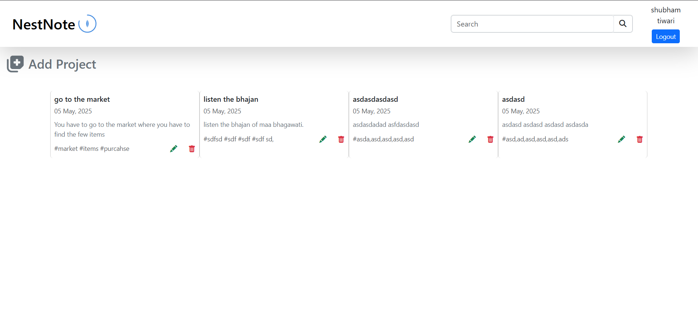
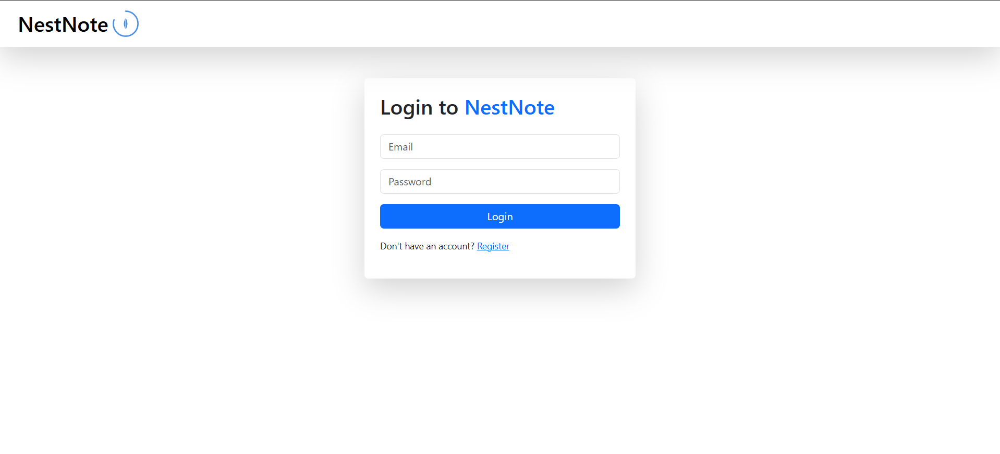
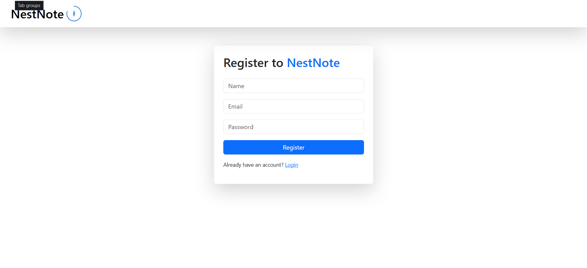
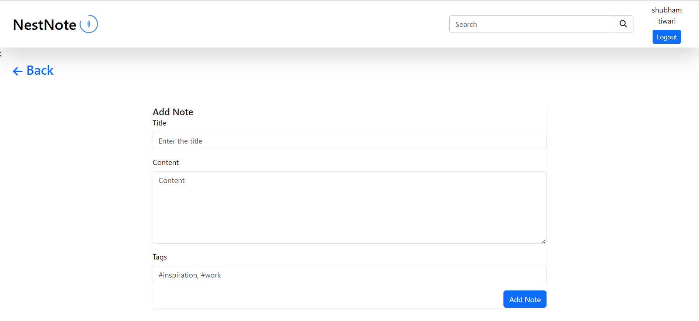
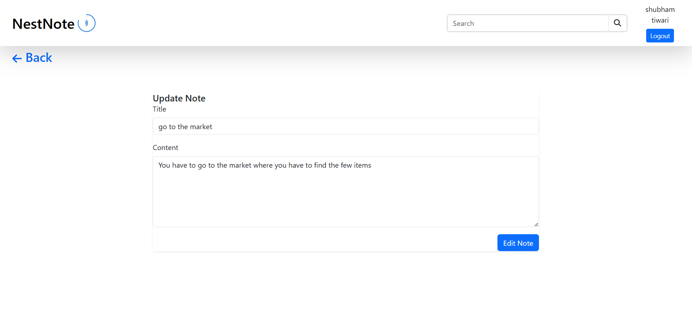
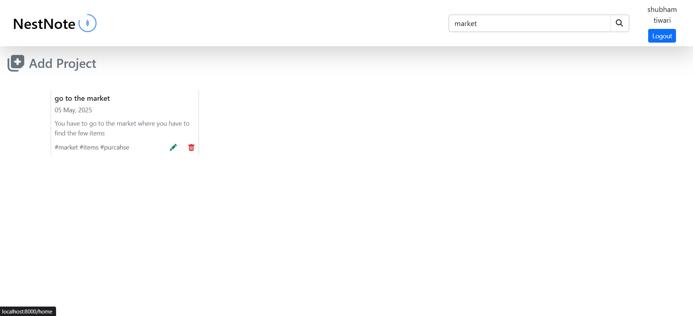

 <h1>NestNote</h1>

NestNote is a modern and minimal note-taking application built with Laravel and powered by a MySQL database. It provides a clean interface to create, edit, and manage notes efficiently — designed for simplicity, speed, and organization.

## Features

🗒️ Create, edit, and delete notes

🔍 Search functionality for quick access

📁 Organize notes with categories or tags (optional feature)

🔐 User authentication (registration, login, logout)

🌙 Dark mode (optional toggle)

✅ Responsive design for all screen sizes

## Tech Stack
Backend: Laravel (PHP Framework)

Database: MySQL

Frontend: Blade templating with Bootstrap

## Screen Shots

NestNote Home page

NestNote Login Page

NestNote Register Page

NestNote Add Note page

NestNote Update Note Page

NestNote Searchquery Page
